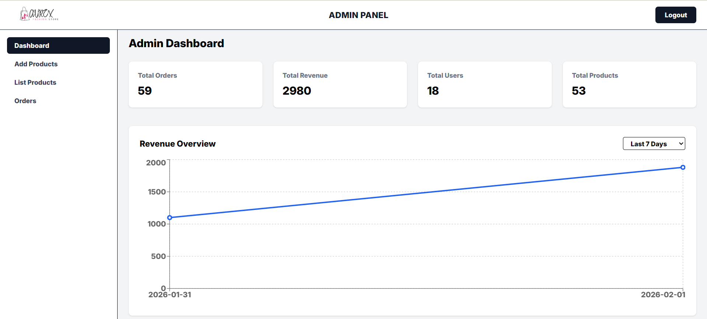
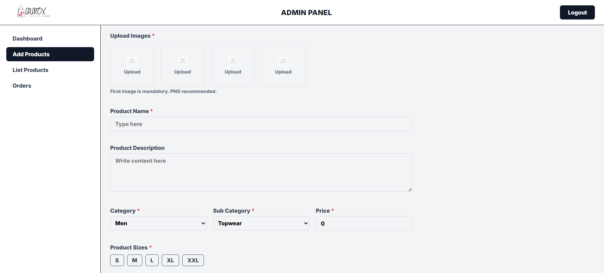
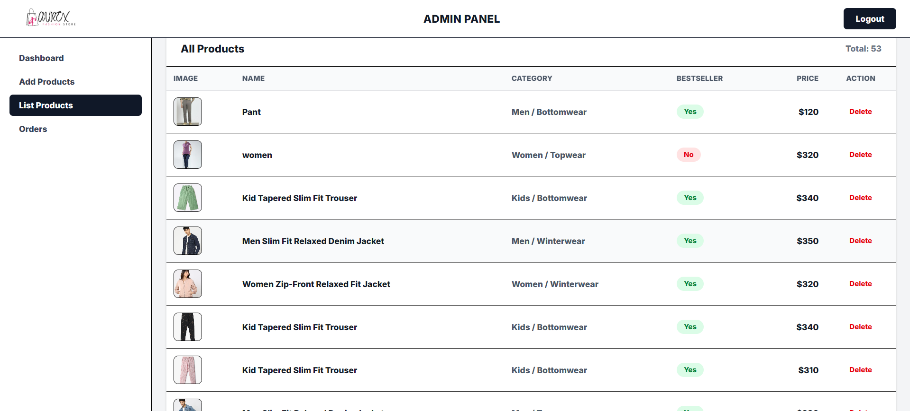
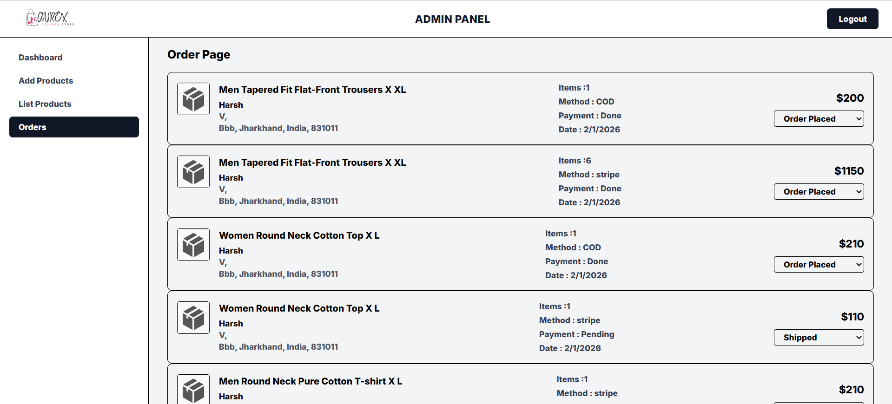

# 🛒 E-commerce Admin Dashboard

<div align="center">


**A powerful and intuitive admin dashboard for managing your e-commerce platform**

[](https://reactjs.org/)
[](https://vitejs.dev/)
[](https://tailwindcss.com/)
[](https://developer.mozilla.org/en-US/docs/Web/JavaScript)

</div>

---

## 📋 Overview

The **E-commerce Admin Dashboard** is a comprehensive web application designed to provide administrative insights and complete management capabilities for e-commerce platforms. Built with modern technologies, this dashboard offers a seamless experience for managing products, orders, customers, and analyzing business metrics.

---

## ✨ Key Features

### 🔐 Authentication & Security
- **Secure Login System**: Token-based authentication with session management
- **Protected Routes**: Role-based access control for different admin levels
- **Auto-logout**: Automatic session timeout for enhanced security

### 📊 Dashboard & Analytics
- **Statistical Overview**: Real-time insights into business performance
- **Interactive Charts**: Visual representation of sales, revenue, and user data
- **Time Range Filters**: Analyze data across different time periods
- **Performance Metrics**: Track KPIs and business health indicators

### 🛍️ Product Management
- Add, edit, and delete products
- Category and inventory management
- Product image upload and management
- Stock tracking and alerts

### 📦 Order Management
- View and process customer orders
- Order status tracking
- Order history and analytics
- Invoice generation

### 👥 Customer Management
- Customer database and profiles
- Customer activity tracking
- Communication tools

### 🔔 Notifications
- Real-time toast notifications using React Toastify
- Success, error, and warning messages
- Custom notification positioning and styling

---

## 🛠️ Tech Stack

<div align="center">

### Frontend Technologies


</div>

| Technology | Purpose |
|------------|---------|
| **React** | UI component library for building interactive interfaces |
| **Vite** | Next-generation frontend build tool for faster development |
| **React Router** | Client-side routing and navigation |
| **Tailwind CSS** | Utility-first CSS framework for responsive design |
| **React Toastify** | Elegant notification management |
| **ESLint** | Code quality and consistency |

---

## 🚀 Getting Started

### Prerequisites

Before you begin, ensure you have the following installed:
- **Node.js** (v14.0 or higher)
- **npm** or **yarn** package manager

### Installation

1. **Clone the Repository**
   ```bash
   git clone https://github.com/Harsh-Kumar-Pandit/Ecommerce-admin.git
   cd Ecommerce-admin
   ```

2. **Install Dependencies**
   ```bash
   npm install
   # or
   yarn install
   ```

3. **Configure Environment Variables**
   
   Create a `.env` file in the root directory:
   ```env
   VITE_API_URL=your_backend_api_url
   VITE_APP_PORT=5174
   ```

4. **Start Development Server**
   ```bash
   npm run dev
   # or
   yarn dev
   ```

5. **Access the Application**
   
   Open your browser and navigate to:
   ```
   http://localhost:5174
   ```

---

## 📂 Project Structure

```
Ecommerce-admin/
├── config/
│   └── api.jsx              # API configuration and endpoints
├── public/                  # Static assets
├── src/
│   ├── components/
│   │   ├── Login.jsx        # Authentication component
│   │   └── ...              # Other reusable components
│   ├── pages/
│   │   ├── Admin.jsx        # Admin panel container
│   │   ├── Dashboard.jsx    # Main dashboard with analytics
│   │   └── ...              # Other admin pages
│   ├── App.jsx              # Main application component
│   ├── main.jsx             # Application entry point
│   └── index.css            # Global styles
├── .env                     # Environment variables
├── .gitignore              # Git ignore rules
├── eslint.config.js        # ESLint configuration
├── index.html              # HTML entry point
├── package.json            # Project dependencies
├── tailwind.config.js      # Tailwind CSS configuration
├── vite.config.js          # Vite configuration
└── README.md               # Project documentation
```

---

## 📸 Screenshots

<div align="center">

<table>
<tr>
<td width="50%">

### 🎨 Dashboard Overview

<p><i>Main dashboard with analytics, charts, and key performance metrics</i></p>

</td>
<td width="50%">

### ➕ Add Product Interface

<p><i>Product creation and management interface</i></p>

</td>
</tr>

<tr>
<td width="50%">

### 📋 Product List Management

<p><i>Comprehensive product listing with edit and delete options</i></p>

</td>
<td width="50%">

### 📦 Order Management

<p><i>Order tracking, status updates, and fulfillment dashboard</i></p>

</td>
</tr>
</table>

</div>

---

## 💻 Usage

### Login to Dashboard

1. Navigate to the login page
2. Enter your admin credentials
3. Upon successful authentication, you'll be redirected to the dashboard

### Managing Products

1. Navigate to the Products section
2. Click "Add Product" to create new products
3. Use edit/delete options to manage existing products

### Viewing Analytics

1. Access the Dashboard page
2. Select your preferred time range
3. View real-time statistics and charts
4. Analyze revenue, orders, and customer data

---

## 🎨 Features in Detail

### Dashboard Components

- **Revenue Charts**: Visual representation of revenue trends
- **Order Statistics**: Track order volumes and status
- **Customer Analytics**: User engagement and growth metrics
- **Quick Actions**: Fast access to common administrative tasks

### Responsive Design

Built with Tailwind CSS, the dashboard is fully responsive and works seamlessly across:
- 💻 Desktop computers
- 📱 Tablets
- 📱 Mobile devices

---

## 🔧 Configuration

### API Configuration

Update the API endpoints in `config/api.jsx`:

```javascript
export const backendUrl = import.meta.env.VITE_API_URL || 'http://localhost:4000';
```

### Tailwind Customization

Modify `tailwind.config.js` to customize the design:

```javascript
module.exports = {
  content: ['./index.html', './src/**/*.{js,jsx}'],
  theme: {
    extend: {
      // Your custom configurations
    },
  },
  plugins: [],
};
```

---

## 📜 Available Scripts

| Command | Description |
|---------|-------------|
| `npm run dev` | Start development server |
| `npm run build` | Build for production |
| `npm run preview` | Preview production build |
| `npm run lint` | Run ESLint for code quality |

---

## 🤝 Contributing

Contributions are welcome! Here's how you can help:

1. **Fork the Project**
2. **Create a Feature Branch**
   ```bash
   git checkout -b feature/AmazingFeature
   ```
3. **Commit Your Changes**
   ```bash
   git commit -m 'Add some AmazingFeature'
   ```
4. **Push to the Branch**
   ```bash
   git push origin feature/AmazingFeature
   ```
5. **Open a Pull Request**

---

## 🐛 Bug Reports & Feature Requests

If you encounter any bugs or have feature suggestions:
- Open an [issue](https://github.com/Harsh-Kumar-Pandit/Ecommerce-admin/issues)
- Provide detailed information about the bug or feature
- Include screenshots if applicable

---

## 📝 License

This project is licensed under the **MIT License**. See the [LICENSE](LICENSE) file for details.

---

## 👨‍💻 Author

**Harsh Kumar Pandit**

- GitHub: [@Harsh-Kumar-Pandit](https://github.com/Harsh-Kumar-Pandit)

---

## 🙏 Acknowledgments

- React community for excellent documentation
- Tailwind CSS for the amazing utility-first framework
- Vite team for the blazing-fast build tool
- All contributors who help improve this project

---

<div align="center">

**⭐ Star this repository if you find it helpful!**


Made with ❤️ by [Harsh Kumar Pandit](https://github.com/Harsh-Kumar-Pandit)

</div>
